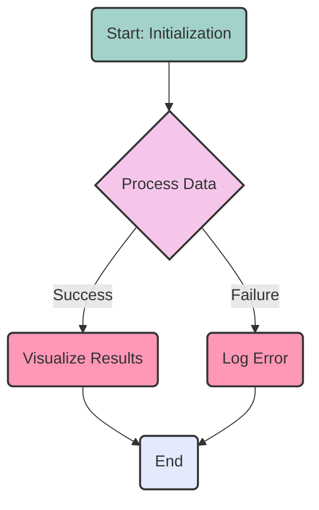

# ArielJS Project

ArielJS is a jQuery-style, chainable JavaScript SDK for creating and converting Mermaid diagrams.

```javascript
// Express your diagrams naturally with a chainable API
flowchart.flow('Start').to('Process').to('Decision')
  .flow('Decision').to('Yes Path', {}, 'Yes')
  .flow('Decision').to('No Path', {}, 'No');
```

ArielJS supports ALL Mermaid diagram types with an emphasis on fluent, chainable interfaces that make your diagrams easy to read and maintain. It also provides bidirectional conversion and customizable terminology to fit your specific domain language.


## Supported Diagram Types

- **Flowcharts** - with simplified flow API for connected nodes
- **Sequence Diagrams** - for interactions between components
- **Class Diagrams** - for object-oriented relationships
- **Entity Relationship Diagrams** - for database modeling
- **State Diagrams** - for state machines and transitions
- **Gantt Charts** - for project planning and scheduling
- **Pie Charts** - for data visualization
- **User Journeys** - for user experience mapping
- **Mindmaps** - for organizing related ideas
- **Git Graphs** - for visualizing git workflows
- ... and more\!

## Installation

### Via npm

```bash
npm install ariel-js
```

### Manual Setup

1. Clone this repository:
   ```bash
   git clone https://github.com/yourusername/ariel-js-project.git
   ```

2. Navigate to the project directory:
   ```bash
   cd ariel-js-project
   ```

3. Install dependencies:
   ```bash
   npm install
   ```

## Testing & Demos

- **Node.js Test**: Run the test script to see ArielJS in action:
  ```bash
  npm test
  ```

- **All Diagram Types**: View examples of all supported diagram types:
  ```bash
  node tests/all-diagram-types.js
  ```

- **Browser Demo**: Open `public/index.html` in a browser to visualize a Mermaid diagram.

- **Examples Viewer**: Launch the examples viewer to see all diagram types:
  ```bash
  cd charts && python3 -m http.server 8000
  ```
  Then open http://localhost:8000/examples-viewer.html in your browser.

## Usage

### Creating Diagrams

```javascript
// If installed via npm
import createArielJS from 'ariel-js';

// OR if using local files
// import createArielJS from './src/ariel-js.js';

// Create a specific diagram type
const ariel = createArielJS();
const flowchart = ariel('flowchart', 'TD');
const sequence = ariel('sequence');
const classDiagram = ariel('class');
const erDiagram = ariel('er');
// etc.
```

### Flowchart Examples

#### Classic Approach
```javascript
const chart = ariel('flowchart', 'LR')
    .node('A', 'Start')
    .edge('B', 'Next')
    .node('B', 'End');
```

#### Simplified Flow API
```javascript
const chart = ariel('flowchart', 'LR')
    .flow('A', 'Start', { shape: 'stadium' })
    .to('B', 'Process', { shape: 'rect' })
    .to('C', 'Decision', { shape: 'diamond' })
    
    // Create branches
    .flow('C')
    .to('D', 'Yes Path', {}, 'Yes')
    .to('F', 'End', { shape: 'stadium' })
    
    .flow('C')
    .to('E', 'No Path', {}, 'No')
    .to('F');
```

### Sequence Diagram Example

```javascript
const sequence = ariel('sequence')
    .participant('User', null, { type: 'actor' })
    .participant('Browser')
    .participant('Server')
    .message('User', 'Browser', 'Request Page')
    .message('Browser', 'Server', 'API Request')
    .message('Server', 'Browser', 'Response', { type: '-->' })
    .message('Browser', 'User', 'Display Page', { type: '-->' })
    .note('over', ['Browser', 'Server'], 'Critical Exchange');
```

### Class Diagram Example

```javascript
const classDiagram = ariel('class')
    .class('Animal')
    .attribute('Animal', 'name', 'String', '+')
    .method('Animal', 'makeSound', null, [], '+')
    .class('Dog')
    .attribute('Dog', 'breed', 'String', '+')
    .method('Dog', 'bark', null, [], '+')
    .inheritance('Dog', 'Animal');
```

### Entity Relationship Diagram Example

```javascript
const erDiagram = ariel('er')
    .entity('CUSTOMER')
    .attribute('CUSTOMER', 'id', 'string', 'PK')
    .attribute('CUSTOMER', 'name', 'string')
    .entity('ORDER')
    .attribute('ORDER', 'id', 'string', 'PK')
    .attribute('ORDER', 'customerId', 'string', 'FK')
    .oneToMany('CUSTOMER', 'ORDER', 'places');
```

### Gantt Chart Example

```javascript
const gantt = ariel('gantt')
    .setTitle('Project Schedule')
    .setDateFormat('YYYY-MM-DD')
    .section('Planning')
    .task('Requirements', 'req', { start: '2023-01-01', end: '2023-01-05' })
    .task('Design', 'design', { start: '2023-01-06', end: '2023-01-15' })
    .section('Development')
    .task('Implementation', 'impl', { start: '2023-01-16', end: '2023-01-31' });
```

### Custom Terminology

```javascript
const builder = createArielJS({
    methods: { addStep: 'node', connectTo: 'edge' },
    properties: { nodeType: 'shape' }
});
```

### Converting from Mermaid Syntax

```javascript
const mermaid = 'graph TD; A-->B;';
console.log(createArielJS().fromMermaid(mermaid));
```

## Example Driven Development

ArielJS uses a chainable API that makes diagram creation intuitive and readable. The chains follow a consistent pattern, with each method returning `this` to allow method chaining. The indentation in your code can visually represent the structure of your diagram, making complex diagrams easier to understand and maintain.

### Example: Basic Flowchart

**Mermaid code:**


**Equivalent ArielJS code:**
```javascript
import createArielJS from 'ariel-js';

// Build the flowchart using the simplified flow API
const ariel = createArielJS();
const chart = ariel('flowchart', 'TD')
    .flow('A', 'Start: Initialization', { shape: 'round' })
    .to('B', 'Process Data', { shape: 'diamond' })

    // Success path
    .flow('B')
    .to('C', 'Visualize Results', { shape: 'round' }, 'Success')
    .to('E', 'End', { shape: 'round' })

    // Failure path
    .flow('B')
    .to('D', 'Log Error', { shape: 'round' }, 'Failure')
    .to('E')

    // Apply styles
    .style('A', {"fill":"#a3d2ca","stroke":"#333","stroke-width":"2px"})
    .style('B', {"fill":"#f6c6ea","stroke":"#333","stroke-width":"2px"})
    .style('C', {"fill":"#ff97b7","stroke":"#333","stroke-width":"2px"})
    .style('D', {"fill":"#ff97b7","stroke":"#333","stroke-width":"2px"})
    .style('E', {"fill":"#e2eafc","stroke":"#333","stroke-width":"2px"});

console.log(chart.toMermaid());
```

## API Glossary

The ArielJS library provides a consistent, chainable API for all diagram types. The core verbs follow these patterns:

| Verb Pattern | Purpose | Examples |
|--------------|---------|----------|
| **add/create** | Add elements to diagrams | `node()`, `entity()`, `participant()` |
| **connect** | Create relationships | `edge()`, `to()`, `message()` |
| **set** | Configure diagrams | `setDirection()`, `setTitle()` |
| **annotate** | Add documentation | `note()`, `style()` |
| **group** | Create containers | `subgraph()`, `section()`, `loop()` |

Here's a comprehensive glossary of methods by diagram type:

### Common Methods (All Diagram Types)
- `toMermaid()` - Converts the diagram to Mermaid syntax
- `addLine(line, indent)` - Adds a line to the diagram with specified indentation
- `addLines(lines, indent)` - Adds multiple lines to the diagram

### Flowchart Methods
- `graph(direction)` - Sets the direction of the flowchart (TB, TD, BT, RL, LR)
- `setDirection(direction)` - Sets the direction of the flowchart (alias)
- `node(id, label, options)` - Creates a node with the specified ID and label
- `edge(targetId, label, options)` - Creates an edge from the current node to the target
- `subgraph(id, label, callback)` - Creates a subgraph/container with nested content
- `style(selector, properties)` - Applies CSS-style properties to a node or edge
- `class(className, ...nodeIds)` - Assigns CSS classes to nodes
- `note(text, target)` - Adds a comment/note to the diagram
- `flow(id, label, options)` - Simplified API: starts a flow from a specific node
- `to(id, label, nodeOptions, edgeLabel, edgeOptions)` - Simplified API: adds a connected node

### Sequence Diagram Methods
- `participant(name, alias, options)` - Adds an actor/participant to the diagram
- `message(from, to, text, options)` - Creates a message between actors
- `note(position, actors, text)` - Adds a note to one or more actors
- `noteOver(actors, text)` - Adds a note over actors
- `noteLeft(actor, text)` - Adds a note to the left of an actor
- `noteRight(actor, text)` - Adds a note to the right of an actor
- `loop(label, callback)` - Creates a loop section
- `alt(label, callback)` - Starts an alternative section
- `else(label, callback)` - Adds an else branch to an alt section
- `opt(label, callback)` - Creates an optional section
- `par(label, callback)` - Creates a parallel section
- `activate(actor)` - Activates an actor (showing it's processing)
- `deactivate(actor)` - Deactivates an actor
- `destroy(actor)` - Marks an actor as destroyed

### Class Diagram Methods
- `class(name, definition)` - Defines a class
- `attribute(className, attrName, type, visibility)` - Adds an attribute to a class
- `method(className, methodName, returnType, params, visibility)` - Adds a method to a class
- `inheritance(child, parent)` - Creates an inheritance relationship
- `composition(container, contained)` - Creates a composition relationship
- `aggregation(container, contained)` - Creates an aggregation relationship
- `association(from, to)` - Creates an association relationship
- `dependency(dependent, dependency)` - Creates a dependency relationship

### Entity Relationship Diagram Methods
- `entity(name, attributes)` - Defines an entity
- `attribute(entityName, name, type, key, comment)` - Adds an attribute to an entity
- `oneToOne(entity1, entity2, label)` - Creates a one-to-one relationship
- `oneToMany(entity1, entity2, label)` - Creates a one-to-many relationship
- `manyToMany(entity1, entity2, label)` - Creates a many-to-many relationship

### Mindmap Methods
- `root(text)` - Creates the root node of the mindmap
- `child(text, shape)` - Adds a child to the current node and moves to it
- `sibling(text, shape)` - Adds a sibling to the current node and moves to it
- `parent(text, shape)` - Moves up to parent level and adds a node

## Advanced Adapters

ArielJS provides a powerful adapter system that allows you to customize the API to fit your specific domain language, terminology, and workflow patterns.

### 1. Method Name Customization

The most basic form of adaptation is renaming methods to use domain-specific terminology:

```javascript
const workflowBuilder = createArielJS({
    methods: {
        // Map custom method names to standard methods
        addStep: 'node',         // Use addStep() instead of node()
        connectTo: 'edge',       // Use connectTo() instead of edge()
        startAt: 'flow',         // Use startAt() instead of flow()
        goTo: 'to'               // Use goTo() instead of to()
    }
});

// Using domain-specific method names
const workflow = workflowBuilder('flowchart', 'TD')
    .addStep('A', 'Start Process', { shape: 'stadium' })
    .connectTo('B', 'Process Data')
    .startAt('B')
    .goTo('C', 'Output', {}, 'Complete');
```

### 2. Property Name Customization

You can rename property keys to match your domain terminology:

```javascript
const processBuilder = createArielJS({
    properties: {
        // Use domain-specific property names
        stepType: 'shape',       // Use stepType instead of shape
        primaryColor: 'fill',    // Use primaryColor instead of fill
        borderColor: 'stroke',   // Use borderColor instead of stroke
        connectionType: 'type'   // Use connectionType instead of type
    }
});

// Using domain-specific property names
const process = processBuilder('flowchart', 'TD')
    .node('A', 'Start', {
        stepType: 'stadium',
        primaryColor: '#bbdefb',
        borderColor: '#1976d2'
    });
```

### 3. Parameter Reordering

You can rearrange method parameters to create more natural APIs for your domain:

```javascript
const apiBuilder = createArielJS({
    parameters: {
        // Swap the id and label parameters for node method
        // Original: node(id, label, options)
        // New: node(label, id, options)
        node: [1, 0, 2],

        // Move the label to be the first parameter for edge
        // Original: edge(targetId, label, options)
        // New: edge(label, targetId, options)
        edge: [2, 0, 1]
    }
});

// Using reordered parameters for more natural APIs
const api = apiBuilder('flowchart', 'LR')
    // Instead of node(id, label, options)
    .node('Start Process', 'A', { shape: 'stadium' })
    // Instead of edge(targetId, label, options)
    .edge('Process', 'B');
```

### 4. Custom Methods

You can create completely new methods that implement complex operations:

```javascript
const pipelineBuilder = createArielJS({
    customMethods: {
        // Add a specialized method for creating pipeline segments
        segment: function(id, name, type, options = {}) {
            // Choose shape based on segment type
            const shape = type === 'source' ? 'circle' :
                          type === 'sink' ? 'stadium' : 'rect';

            // Create the node with appropriate styling
            return this.node(id, name, {
                shape,
                style: { fill: options.color || '#f5f5f5' }
            });
        },

        // Add a specialized method for data flows
        dataFlow: function(fromId, toId, dataLabel) {
            return this.node(fromId)
                   .edge(toId, dataLabel || 'data');
        }
    }
});

// Using custom domain-specific methods
const pipeline = pipelineBuilder('flowchart', 'LR')
    .segment('SRC', 'Data Source', 'source', { color: '#bbdefb' })
    .dataFlow('SRC', 'PROC', 'raw data')
    .segment('PROC', 'Process', 'processor', { color: '#c8e6c9' })
    .dataFlow('PROC', 'SINK', 'processed data')
    .segment('SINK', 'Database', 'sink', { color: '#ffccbc' });
```

### 5. Complete Domain-Specific Adapters

Combine all of these capabilities to create complete domain-specific languages:

```javascript
// Factory function for creating data pipeline diagrams
const createPipeline = () => {
    return createArielJS({
        // Custom method names for pipeline terminology
        methods: {
            source: 'node',
            processor: 'node',
            sink: 'node',
            pipe: 'edge'
        },

        // Custom properties for pipeline components
        properties: {
            sourceType: 'shape',
            processorType: 'shape',
            sinkType: 'shape',
            dataType: 'label'
        },

        // Custom methods for pipeline operations
        customMethods: {
            extract: function(id, source) {
                return this.node(id, `Extract from ${source}`, { shape: 'circle' });
            },

            transform: function(id, operation) {
                return this.node(id, `Transform: ${operation}`, { shape: 'rect' });
            },

            load: function(id, destination) {
                return this.node(id, `Load to ${destination}`, { shape: 'stadium' });
            }
        }
    })('flowchart', 'LR'); // Always create a left-to-right flowchart
};

// Using a complete domain-specific adapter
const etlPipeline = createPipeline()
    .extract('E1', 'MySQL')
    .pipe('T1', 'raw records')
    .transform('T1', 'Filter & Clean')
    .pipe('T2', 'clean records')
    .transform('T2', 'Aggregate')
    .pipe('L1', 'summary data')
    .load('L1', 'Data Warehouse');
```

See [examples/adapter.js](examples/adapter.js) for complete examples of creating and using adapters.

## Files

- `src/ariel-js.js`: The ArielJS library
- `tests/`: Test scripts and examples
  - `test.js`: Basic test script
  - `all-diagram-types.js`: Examples of all diagram types
  - `bidirectional-test.js`: Tests for Mermaid conversion
  - `flow-api-test.js`: Tests for the simplified flow API
  - `mindmap-test.js`: Tests for mindmap chaining
- `examples/`: Advanced usage examples
  - `adapter.js`: Examples of custom adapters and domain-specific APIs
- `charts/`: Diagram examples and viewers
  - `examples-viewer.html`: Interactive diagram viewer
  - `examples/`: Example diagrams in Markdown format
  - `example-converted.js`: Example of converted JavaScript code
- `LICENSE`: MIT License
