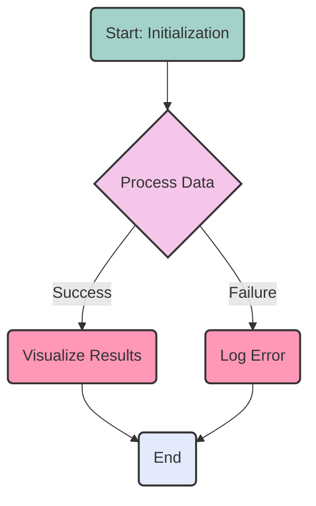

# Basic Flowchart

A simple top-down flowchart with decision node.

```mermaid
flowchart TD
    A("Start: Initialization")
    B{"Process Data"}
    C("Visualize Results")
    D("Log Error")
    E("End")

    A --> B
    B -->|Success| C
    B -->|Failure| D
    C --> E
    D --> E
    
    style A fill:#a3d2ca,stroke:#333,stroke-width:2px;
    style B fill:#f6c6ea,stroke:#333,stroke-width:2px;
    style C fill:#ff97b7,stroke:#333,stroke-width:2px;
    style D fill:#ff97b7,stroke:#333,stroke-width:2px;
    style E fill:#e2eafc,stroke:#333,stroke-width:2px;
```