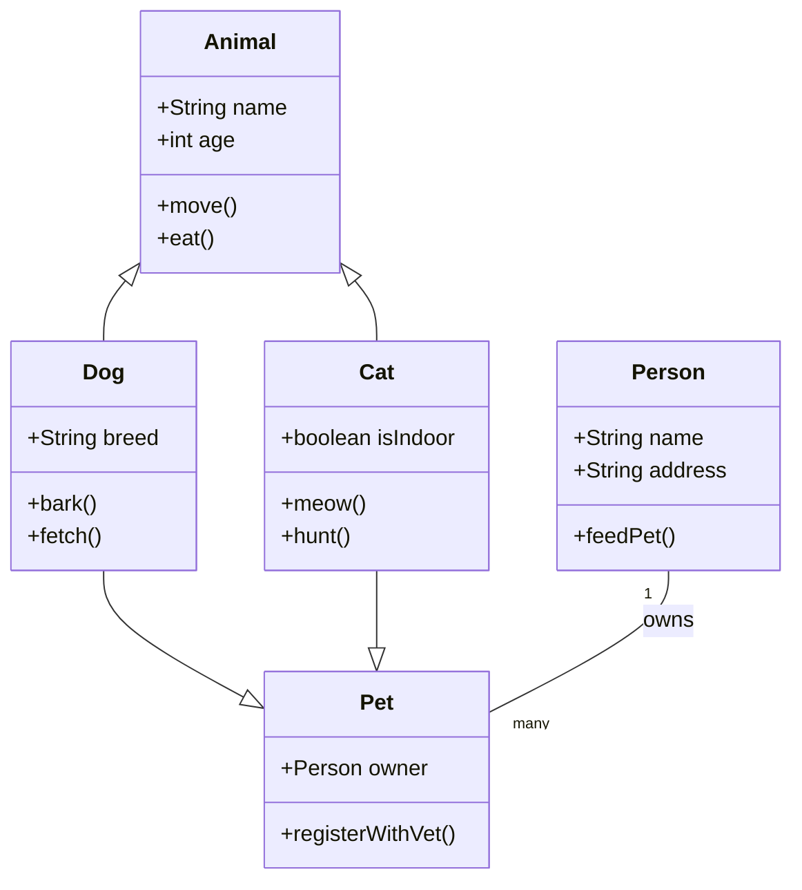

# Class Diagram Example

A class diagram showing relationships between different classes.

```mermaid
classDiagram
    class Animal {
        +String name
        +int age
        +move()
        +eat()
    }
    
    class Dog {
        +String breed
        +bark()
        +fetch()
    }
    
    class Cat {
        +boolean isIndoor
        +meow()
        +hunt()
    }
    
    class Pet {
        +Person owner
        +registerWithVet()
    }
    
    class Person {
        +String name
        +String address
        +feedPet()
    }
    
    Animal <|-- Dog
    Animal <|-- Cat
    Dog --|> Pet
    Cat --|> Pet
    Person "1" -- "many" Pet : owns
```