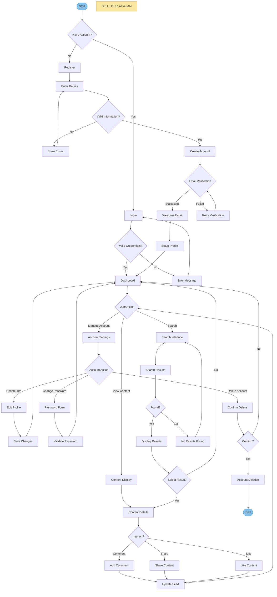

# Complex Flowchart Example

A complex flowchart with multiple decision points and parallel paths.

```mermaid
flowchart TD
    A([Start]) --> B{Have Account?}
    B -->|Yes| C[Login]
    B -->|No| D[Register]
    
    C --> E{Valid Credentials?}
    E -->|Yes| F[Dashboard]
    E -->|No| G[Error Message]
    G --> C
    
    D --> H[Enter Details]
    H --> I{Valid Information?}
    I -->|No| J[Show Errors]
    J --> H
    I -->|Yes| K[Create Account]
    K --> L{Email Verification}
    
    L -->|Successful| M[Welcome Email]
    L -->|Failed| N[Retry Verification]
    N --> L
    
    M --> O[Setup Profile]
    O --> F
    
    F --> P{User Action}
    P -->|View Content| Q[Content Display]
    P -->|Manage Account| R[Account Settings]
    P -->|Search| S[Search Interface]
    
    Q --> T[Content Details]
    T --> U{Interact?}
    U -->|Comment| V[Add Comment]
    U -->|Share| W[Share Content]
    U -->|Like| X[Like Content]
    
    V --> Y[Update Feed]
    W --> Y
    X --> Y
    
    Y --> P
    
    R --> Z{Account Action}
    Z -->|Update Info| AA[Edit Profile]
    Z -->|Change Password| AB[Password Form]
    Z -->|Delete Account| AC[Confirm Delete]
    
    AA --> AD[Save Changes]
    AB --> AE[Validate Password]
    AC --> AF{Confirm?}
    
    AD --> F
    AE --> F
    AF -->|Yes| AG[Account Deletion]
    AF -->|No| F
    
    AG --> AH([End])
    
    S --> AI[Search Results]
    AI --> AJ{Found?}
    AJ -->|Yes| AK[Display Results]
    AJ -->|No| AL[No Results Found]
    
    AK --> AM{Select Result?}
    AM -->|Yes| T
    AM -->|No| F
    
    AL --> S
    
    style A fill:#85C1E9,stroke:#3498DB
    style AH fill:#85C1E9,stroke:#3498DB
    style B,E,I,L,P,U,Z,AF,AJ,AM fill:#F9E79F,stroke:#F39C12
```