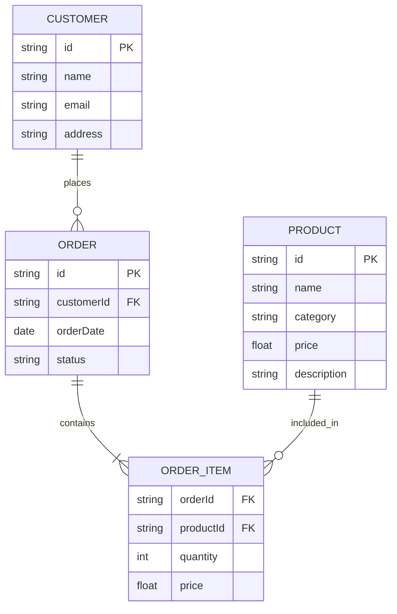

# Entity Relationship Diagram

An ER diagram showing database relationships.

```mermaid
erDiagram
    CUSTOMER ||--o{ ORDER : places
    CUSTOMER {
        string id PK
        string name
        string email
        string address
    }
    ORDER ||--|{ ORDER_ITEM : contains
    ORDER {
        string id PK
        string customerId FK
        date orderDate
        string status
    }
    ORDER_ITEM {
        string orderId FK
        string productId FK
        int quantity
        float price
    }
    PRODUCT ||--o{ ORDER_ITEM : included_in
    PRODUCT {
        string id PK
        string name
        string category
        float price
        string description
    }
```