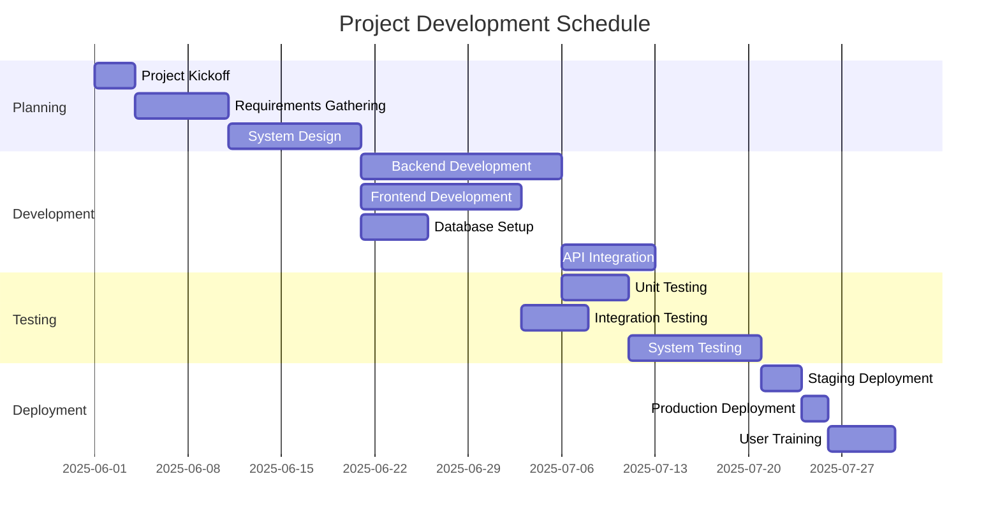

# Gantt Chart Example

A Gantt chart for project planning with tasks and dependencies.

```mermaid
gantt
    title Project Development Schedule
    dateFormat  YYYY-MM-DD
    
    section Planning
    Project Kickoff       :a1, 2025-06-01, 3d
    Requirements Gathering:a2, after a1, 7d
    System Design         :a3, after a2, 10d
    
    section Development
    Backend Development   :b1, after a3, 15d
    Frontend Development  :b2, after a3, 12d
    Database Setup        :b3, after a3, 5d
    API Integration       :b4, after b1, 7d
    
    section Testing
    Unit Testing          :c1, after b1, 5d
    Integration Testing   :c2, after b2, 5d
    System Testing        :c3, after c1, 10d
    
    section Deployment
    Staging Deployment    :d1, after c3, 3d
    Production Deployment :d2, after d1, 2d
    User Training         :d3, after d2, 5d
```