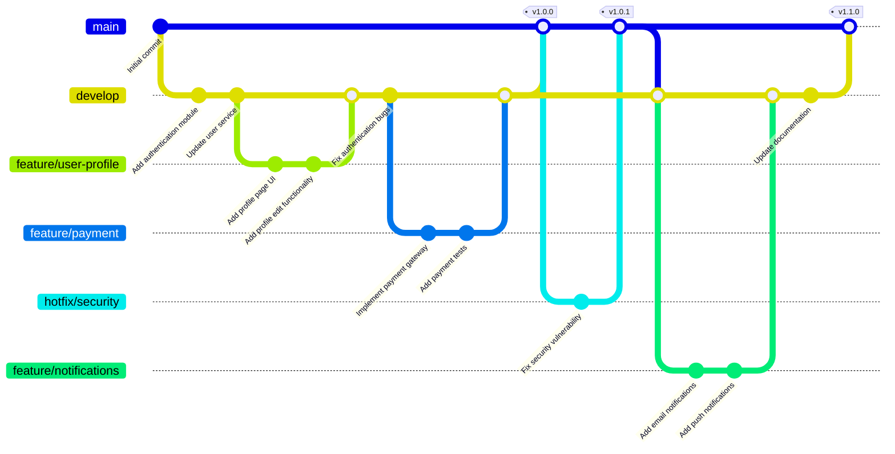

# Git Graph Example

A visualization of Git commits and branches.

```mermaid
gitGraph
    commit id: "Initial commit"
    branch develop
    checkout develop
    commit id: "Add authentication module"
    commit id: "Update user service"
    branch feature/user-profile
    checkout feature/user-profile
    commit id: "Add profile page UI"
    commit id: "Add profile edit functionality"
    checkout develop
    merge feature/user-profile
    commit id: "Fix authentication bugs"
    branch feature/payment
    checkout feature/payment
    commit id: "Implement payment gateway"
    commit id: "Add payment tests"
    checkout develop
    merge feature/payment
    checkout main
    merge develop tag: "v1.0.0"
    branch hotfix/security
    checkout hotfix/security
    commit id: "Fix security vulnerability"
    checkout main
    merge hotfix/security tag: "v1.0.1"
    checkout develop
    merge main
    branch feature/notifications
    checkout feature/notifications
    commit id: "Add email notifications"
    commit id: "Add push notifications"
    checkout develop
    merge feature/notifications
    commit id: "Update documentation"
    checkout main
    merge develop tag: "v1.1.0"
```