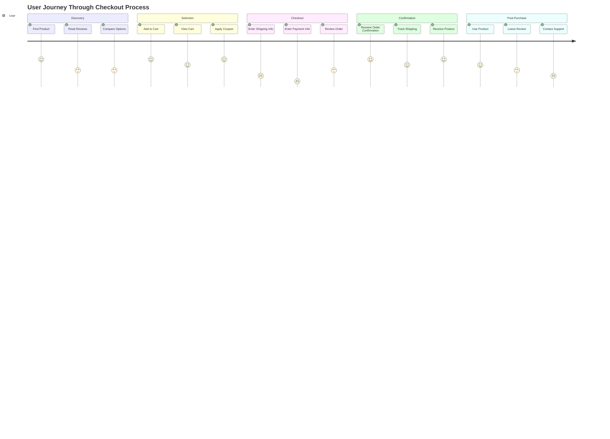

# User Journey Example

A diagram showing user journey through a system with emotions at each stage.

```mermaid
journey
    title User Journey Through Checkout Process
    
    section Discovery
        Find Product: 5: User
        Read Reviews: 3: User
        Compare Options: 3: User
    
    section Selection
        Add to Cart: 5: User
        View Cart: 4: User
        Apply Coupon: 5: User
    
    section Checkout
        Enter Shipping Info: 2: User
        Enter Payment Info: 1: User
        Review Order: 3: User
    
    section Confirmation
        Receive Order Confirmation: 5: User
        Track Shipping: 4: User
        Receive Product: 5: User
    
    section Post-Purchase
        Use Product: 4: User
        Leave Review: 3: User
        Contact Support: 2: User
```