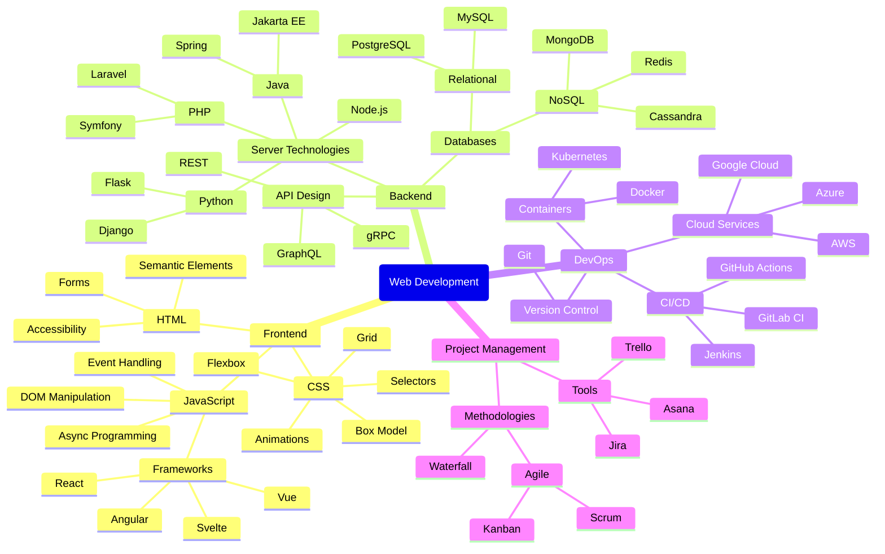

# Mind Map Example

A mind map for organizing related ideas and concepts.

```mermaid
mindmap
    root(Web Development)
        Frontend
            HTML
                Semantic Elements
                Forms
                Accessibility
            CSS
                Selectors
                Box Model
                Flexbox
                Grid
                Animations
            JavaScript
                DOM Manipulation
                Event Handling
                Async Programming
                Frameworks
                    React
                    Vue
                    Angular
                    Svelte
        Backend
            Server Technologies
                Node.js
                Python
                    Django
                    Flask
                PHP
                    Laravel
                    Symfony
                Java
                    Spring
                    Jakarta EE
            Databases
                Relational
                    MySQL
                    PostgreSQL
                NoSQL
                    MongoDB
                    Redis
                    Cassandra
            API Design
                REST
                GraphQL
                gRPC
        DevOps
            Version Control
                Git
            CI/CD
                Jenkins
                GitHub Actions
                GitLab CI
            Containers
                Docker
                Kubernetes
            Cloud Services
                AWS
                Azure
                Google Cloud
        Project Management
            Methodologies
                Agile
                    Scrum
                    Kanban
                Waterfall
            Tools
                Jira
                Trello
                Asana
```