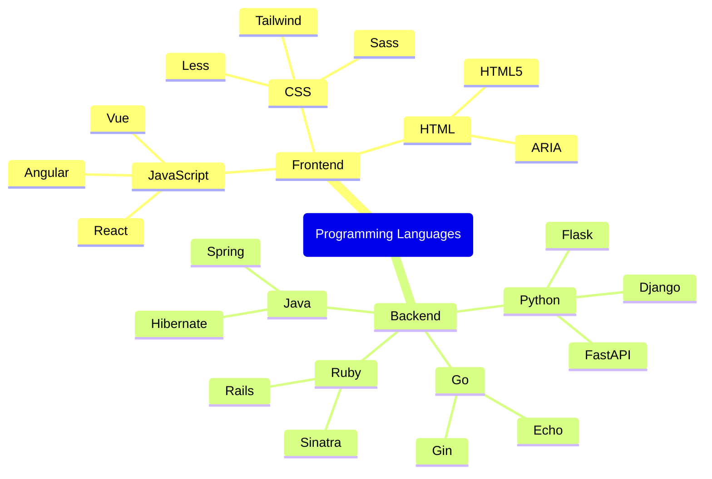

# Mind Map with Proper Chaining

This example demonstrates how to create a mind map with properly chained methods in ArielJS.



## ArielJS Code

The key advantage of ArielJS is the fluent API that allows for chaining methods:

```javascript
import createArielJS from '../src/ariel-js.js';

const ariel = createArielJS();
const mindmap = ariel('mindmap');

mindmap
    .root('Programming Languages')
    .child('Frontend')
        .child('JavaScript')
            .child('React')
            .sibling('Vue')
            .sibling('Angular')
        .parent('CSS')
            .child('Sass')
            .sibling('Less')
            .sibling('Tailwind')
        .parent('HTML')
            .child('HTML5')
            .sibling('ARIA')
    .parent('Backend')
        .child('Python')
            .child('Django')
            .sibling('Flask')
            .sibling('FastAPI')
        .parent('Java')
            .child('Spring')
            .sibling('Hibernate')
        .parent('Go')
            .child('Gin')
            .sibling('Echo')
        .parent('Ruby')
            .child('Rails')
            .sibling('Sinatra');

console.log(mindmap.toMermaid());
```

Notice how the indentation in the code visually matches the structure of the mind map, making it very intuitive to read and maintain.