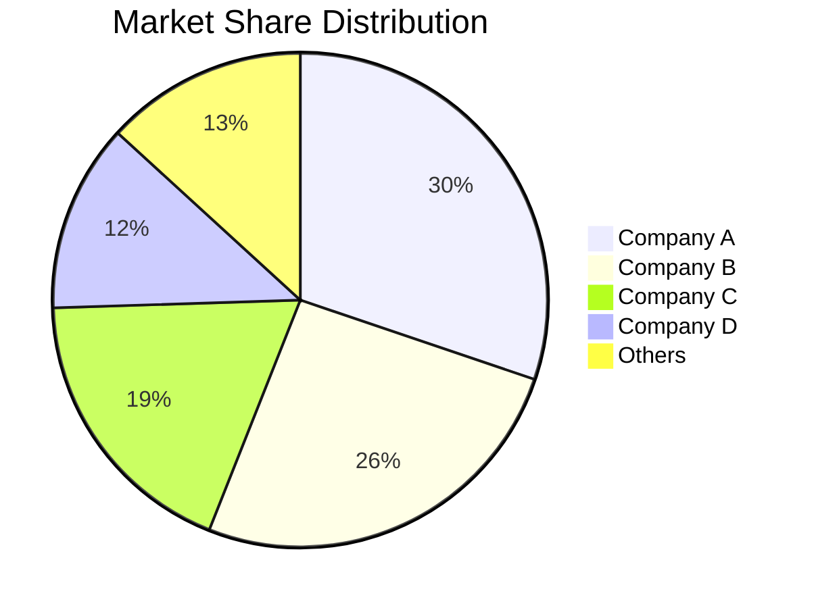

# Pie Chart Example

A pie chart showing data distribution.

```mermaid
pie
    title Market Share Distribution
    "Company A" : 30.2
    "Company B" : 25.8
    "Company C" : 18.5
    "Company D" : 12.3
    "Others" : 13.2
```