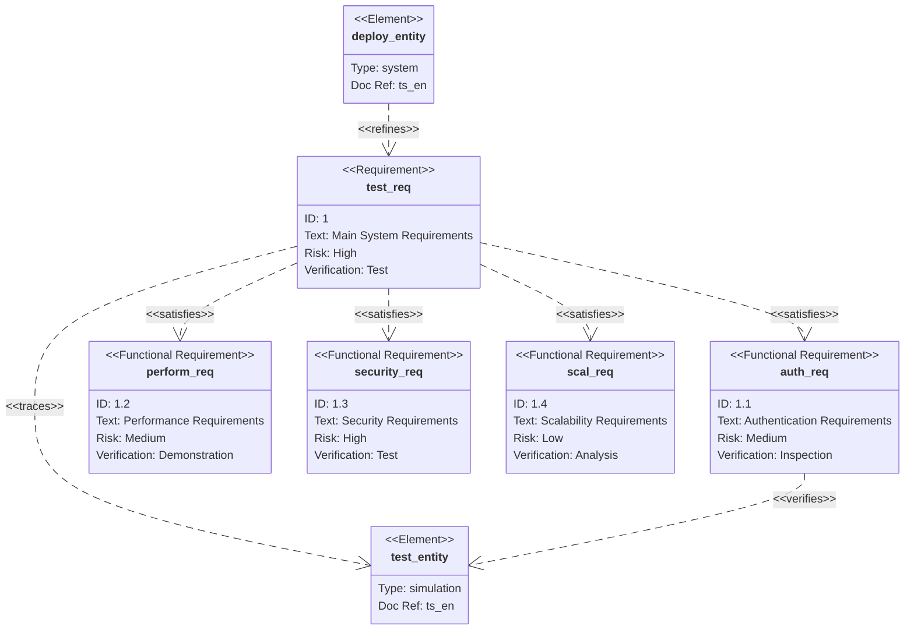

# Requirement Diagram Example

A diagram showing system requirements and their relationships.

```mermaid
requirementDiagram
    requirement test_req {
        id: 1
        text: Main System Requirements
        risk: high
        verifymethod: test
    }

    functionalRequirement auth_req {
        id: 1.1
        text: Authentication Requirements
        risk: medium
        verifymethod: inspection
    }
    
    functionalRequirement perform_req {
        id: 1.2
        text: Performance Requirements
        risk: medium
        verifymethod: demonstration
    }
    
    functionalRequirement security_req {
        id: 1.3
        text: Security Requirements
        risk: high
        verifymethod: test
    }
    
    functionalRequirement scal_req {
        id: 1.4
        text: Scalability Requirements
        risk: low
        verifymethod: analysis
    }
    
    element test_entity {
        type: simulation
        docref: ts_en
    }

    element deploy_entity {
        type: system
        docref: ts_en
    }

    test_req - satisfies -> auth_req
    test_req - satisfies -> perform_req
    test_req - satisfies -> security_req  
    test_req - satisfies -> scal_req

    test_req - traces -> test_entity
    auth_req - verifies -> test_entity
    deploy_entity - refines -> test_req
```