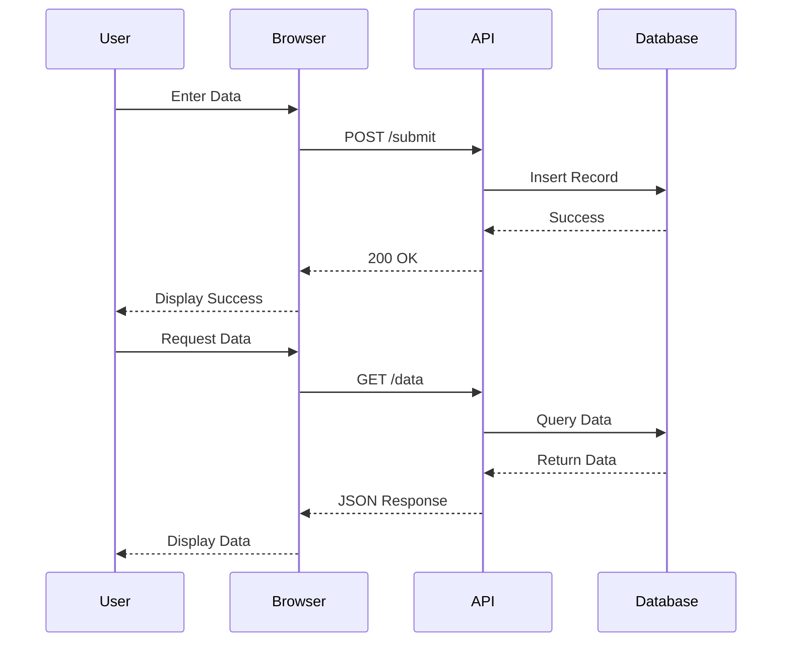

# Sequence Diagram Example

A sequence diagram showing interaction between components.

```mermaid
sequenceDiagram
    participant User
    participant Browser
    participant API
    participant Database
    
    User->>Browser: Enter Data
    Browser->>API: POST /submit
    API->>Database: Insert Record
    Database-->>API: Success
    API-->>Browser: 200 OK
    Browser-->>User: Display Success
    
    User->>Browser: Request Data
    Browser->>API: GET /data
    API->>Database: Query Data
    Database-->>API: Return Data
    API-->>Browser: JSON Response
    Browser-->>User: Display Data
```