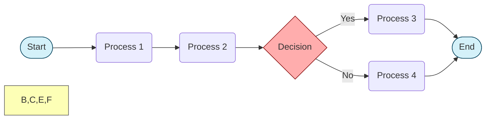

# Simplified Flow API

A flowchart demonstrating the new simplified flow API for easier node connections.

```mermaid
flowchart LR
    A([Start]) --> B(Process 1)
    B --> C(Process 2)
    C --> D{Decision}
    D -->|Yes| E(Process 3)
    D -->|No| F(Process 4)
    E --> G([End])
    F --> G
    
    style A fill:#d4f1f9,stroke:#05445E
    style G fill:#d4f1f9,stroke:#05445E
    style D fill:#ffadad,stroke:#800000
    style B,C,E,F fill:#fdffb6,stroke:#5a5a5a
```