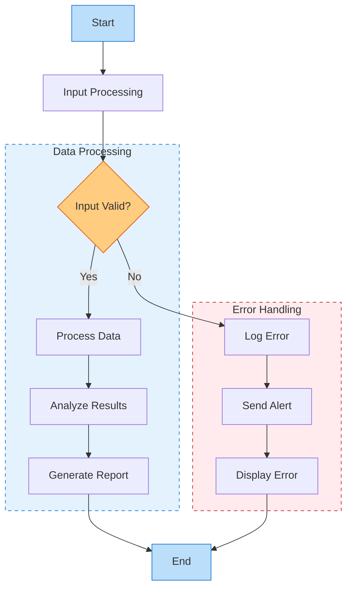

# Flowchart with Subgraphs

A flowchart demonstrating subgraphs for grouping related nodes.

```mermaid
flowchart TD
    A[Start] --> B[Input Processing]
    B --> C{Input Valid?}
    
    subgraph Processing[Data Processing]
        C -->|Yes| D[Process Data]
        D --> E[Analyze Results]
        E --> F[Generate Report]
    end
    
    subgraph Error[Error Handling]
        C -->|No| G[Log Error]
        G --> H[Send Alert]
        H --> I[Display Error]
    end
    
    F --> J[End]
    I --> J
    
    style A fill:#bbdefb,stroke:#1976d2
    style J fill:#bbdefb,stroke:#1976d2
    style C fill:#ffcc80,stroke:#e65100
    style Processing fill:#e3f2fd,stroke:#1976d2,stroke-dasharray: 5 5
    style Error fill:#ffebee,stroke:#c62828,stroke-dasharray: 5 5
```