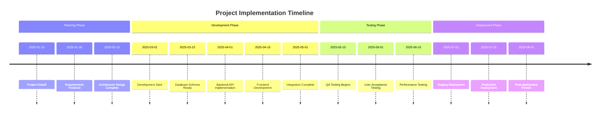

# Timeline Example

A timeline showing major events in a project lifecycle.

```mermaid
timeline
    title Project Implementation Timeline
    
    section Planning Phase
        2025-01-15 : Project Kickoff
        2025-01-30 : Requirements Finalized
        2025-02-15 : Architecture Design Complete
    
    section Development Phase
        2025-03-01 : Development Start
        2025-03-15 : Database Schema Ready
        2025-04-01 : Backend API Implementation
        2025-04-15 : Frontend Development
        2025-05-01 : Integration Complete
    
    section Testing Phase
        2025-05-15 : QA Testing Begins
        2025-06-01 : User Acceptance Testing
        2025-06-15 : Performance Testing
    
    section Deployment Phase
        2025-07-01 : Staging Deployment
        2025-07-15 : Production Deployment
        2025-08-01 : Post-deployment Review
```